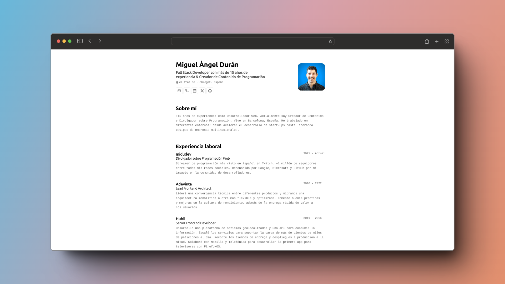

 

<h2>
    <em>Curriculum: </em>Pablo Chorda
</h2>

Esquema del JSON de CV de <a href="https://jsonresume.org/schema/">jsonresume.org</a>

    <a href="#🚀-empezar">
        Empezar
    </a>
    &nbsp;✦&nbsp;
    <a href="#🧞-comandos">
        Comandos
    </a>
    &nbsp;✦&nbsp;
    <a href="https://porthub-pablo-chorda.netlify.app/">
        Portafolio
    </a>
   

<!--</img>
 -->

## 🛠️ Stack

-   [**Astro**](https://astro.build/) - El framework web de la nueva época.
-   [**Typescript**](https://www.typescriptlang.org/) - JavaScript con sintaxis de tipado.
-   [**Ninja Keys**](https://github.com/ssleptsov/ninja-keys) - Menu desplegable con atajos de teclado hecho en puro Javascript.